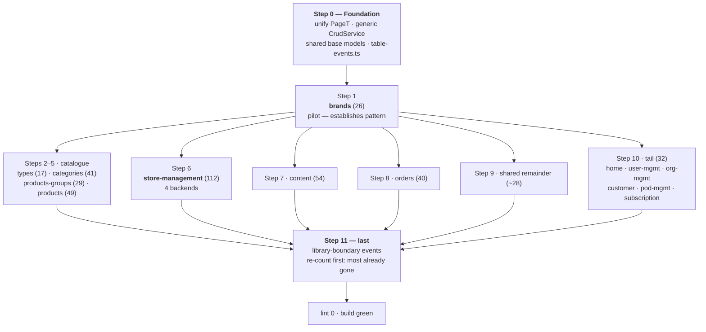

# Eliminating `@typescript-eslint/no-explicit-any` in `store-core/seller-ui`

## Context

`npm run lint` (`ng lint`) is red. Every reported problem in `src/` is
`@typescript-eslint/no-explicit-any`, inherited at `error` severity from
`tseslint.configs.recommended` — the rule is never configured explicitly in
`eslint.config.js`. Measured baseline: **443 `any` tokens across 109 of 339 `.ts` files**
(the eslint count will land at ~441; two tokens are inside comments/strings). The exact
number must be captured with eslint before the first edit — see *Step 0*.

The cause is a **missing domain-model layer**, not scattered sloppiness. `CrudService` is
untyped (`get(path, params?: any): Observable<any>`), so API services return `Observable<any>`,
facades park the result in `signal<any>`, and components accept `@Input() x: any`. Verified
distribution:

| Layer | `any` tokens |
|---|---|
| `*.facade.ts` | 201 |
| `*.service.ts` | 190 |
| `*.component.ts` | 33 |
| models / plain `.ts` | 19 |

`strictTemplates: true` is already on, but because every server row arrives as `any`, Angular's
template checker currently validates almost nothing about server data. Typing the API layer
pays off twice: it clears ~88% of violations directly, and it turns on real template checking
for the first time.

**Outcome:** `npm run lint` reports 0 problems, backed by committed, hand-written TypeScript
models derived from the Java DTOs that are the actual wire contract.

### Decisions (confirmed with the user)

- **Scope: all of it.** Steps 0–11, 441 → 0, in this PR.
- **Model source of truth: Java source only**, read from this monorepo. No running services,
  no OpenAPI fetch, no codegen.
- **`tsconfig.json` stays as-is** — `noImplicitAny: false`, `strictNullChecks: false` are not
  flipped here.
- **Third-party events: local structural interfaces** (e.g. our own `DatatablePageEvent`), not
  `unknown` + cast helpers and not the libraries' own exported types.
- **Lockfile:** `**/package-lock.json` is gitignored repo-wide (`.gitignore:` line
  `**/package-lock.json`). `node_modules` is absent in this container. Run `npm install` to
  verify; **do not** commit or un-ignore the lockfile.

---

## Corrections to the draft plan — these were checked against source

These are the points where the draft is wrong or incomplete. Implementers should use the
values below, not the draft's.

1. **`PUT /private/manufacturer/{id}` returns `void`**, not `PersistableManufacturer`.
   `ProductManufacturerApi.update` is declared `public void update(...)`. Only `create`
   (`POST`) echoes `PersistableManufacturer` back. So
   `updateBrand(...): Observable<void>`.
2. **`GET /private/manufacturer/unique` returns `EntityExists`** (`{ exists: boolean }`,
   from `store-pod/commons/store-commons/.../model/entity/EntityExists.java`). The draft
   omits this endpoint's type entirely; `brand-form.facade.ts:65` already reads `res.exists`.
3. **`store.service.ts` carries 26 `any` tokens across 34 methods**, not 36. It is still the
   worst single file. `store-management` totals 112.
4. **"Always take the `-commons/**/model/` one" is wrong for two pods.** Verified DTO
   locations (see the table in *Deriving a model* below): **cua** DTOs live in
   `store-pod/cua/src/main/java/.../web/dto/`, **payment** DTOs in
   `store-pod/payment/payment-core/.../models/`, and **control-plane** DTOs in
   `store-core/control-plane/manager-commons/.../dto/`. Only catalog, merchant and checkout
   follow the `-commons/model/` shape.
5. **The duplicate `Store` interface resolves cleanly** — they are two different backends'
   DTOs, not a mistake. `shared/models/commons.ts#Store` mirrors control-plane's
   `ManagerStoreDto` record (`id: ManagerStoreId, name, orgId, podId, provisioningState`);
   `store-management/models/store.ts#Store` mirrors merchant's `ReadableMerchantStore`.
   Rename to `ManagerStore` and `ReadableMerchantStore` respectively rather than merging.
6. **`brand-form.facade.ts#save()` is not mechanically typeable.** It builds `tmpObj: any` as a
   dynamic accumulator and copies arbitrary keys between description objects with `for...in`.
   That needs an index-signature type (`Record<string, string>`), not
   `PersistableManufacturer`. Expect a handful of these; see *Non-mechanical sites*.
7. **`.model.ts` is not the house convention** — only one file uses it
   (`pages/payment/models/payment-transaction.model.ts`). The four other existing model files
   are `shared/models/{Language,Page,commons,roles,user}.ts` and
   `store-management/models/{banner,logo,social-networks,store}.ts`. Adopt `.model.ts` going
   forward (it is the clearer of the two) and leave the existing plain-named files where they
   are, renaming only the ones being rewritten anyway.
8. **There is a *third* page type**: `shared/models/Page.ts` exports a `Page` class with
   `size`/`totalElements`/`totalPages`/`pageNumber` (no `content`). Fold it into the Step 0
   unification along with the two `PageT<T>`s.
9. **`git grep -c ': any\|<any>\|any\[\]\|as any'` is not a usable acceptance check** —
   `-c` prints per-file counts, and the pattern matches identifiers ending in `any`. eslint
   reaching 0 is the gate; drop the grep criterion.

Everything else in the draft checked out: the `PageT<T>` split (14 importers of
`common/BaseTable.ts` vs 9 of `shared/table/table.types.ts`), the `LanguageCode` →
plain-string serialization, the DTO/JPA-entity name collision on `ManufacturerDescription`,
`PageT<T>` matching `ReadableList<T>` field-for-field except `recordsFiltered`, exactly 2
`as any` (both in the branding facades), exactly 2 `err: any`, and the six
`*-statistic.component.ts` files each with the identical 2 violations at lines 26–27.

---

## Dependency order



Per-layer flow the change is producing, once per feature:

```
Java DTO chain            TS model              service              facade                component
─────────────────────────────────────────────────────────────────────────────────────────────────────
ReadableManufacturer  →  ReadableManufacturer → Observable<          → TableStateService<  → row typed
  extends Manufactur…       (models/*.model.ts)   PageT<ReadableMan…>>   ReadableManufact…>    by inference
  extends Entity                                                                              ↓
                                                                                       strictTemplates
                                                                                       checks bindings
                                                                                       for the first time
```

---

## Deriving a model — the rules

**Walk `extends` to the root and union every field.** DTOs are Lombok + deep inheritance;
one file gives you a fraction of the shape. `@Getter`/`@Setter` at each level means every
private field serializes. Worked chain:

```
ReadableManufacturer        description, descriptions   catalog-commons/model/manufacturer/
  └ ManufacturerEntity      order
      └ Manufacturer        code
          └ Entity          id                          store-commons/commons/domain/
```

**Take the DTO, never the JPA entity.** `ManufacturerDescription` exists twice: the DTO in
`catalog-commons/.../model/manufacturer/` (extends `NamedEntity`) and the JPA entity in
`catalog-core/.../entity/product/manufacturer/` (`@Entity`, `@JsonIgnore` back-reference to
`Manufacturer`, extra `url`/`urlClicked` columns). Use the first.

**Where each backend keeps its DTOs** (verified; the `-commons/model/` rule of thumb only
holds for three of six):

| Backend | URL prefix in seller-ui | DTO package |
|---|---|---|
| catalog | `/spg/catalog/api/v1/…` | `store-pod/catalog/catalog-commons/.../catalog/model/{manufacturer,category,product,product/type,product/group,product/attribute,…}` |
| merchant | `/spg/merchant/api/v1/…` | `store-pod/merchant/merchant-commons/.../merchant/model/merchant/` and `.../merchant/content/model/content/{box,page,common}/` |
| checkout | `/spg/checkout/api/v1/…` | `store-pod/checkout/checkout-commons/.../checkout/model/order/{,history,total}` |
| payment | `/spg/payment/api/v1/…` | `store-pod/payment/payment-core/.../payment/models/` — **not** `-commons/model/` |
| cua | `/spg/cua/api/v1/…` | `store-pod/cua/src/main/java/.../cua/web/dto/` — **not** `-commons/model/` |
| control-plane | `/control-plane/api/v1/…` | `store-core/control-plane/manager-commons/.../manager/commons/dto/` |
| uaa users | via control-plane | `store-commons/uaa-client/.../uaa/domain/user/{ReadableUser,PersistableUser}.java` |

**Value objects usually serialize as strings, not objects.** `ShopEntity.language` is typed
`LanguageCode` (a Java record) but carries
`@JsonSerialize(using = LanguageCodeSerializer.class)`, whose `serialize` calls
`gen.writeString(value.code())` — so on the wire it is `"en"`, not `{ code: "en" }`. Before
typing any value-object field, grep for a custom serializer or `@JsonValue`; default to
`string`. **Exception:** `PodId` has no such serializer and *does* serialize as an object, so
`store.podId.id`. (A store's own id was in that category when this was written; it is now a
bare `string` — see `multi-tenancy.md`.)

**The controller's declared return type is the contract**, and it is not always `Readable*`.
Read the actual method signature in `*Api.java` / `*Controller.java`. `@JsonIgnore` fields are
omitted from the TS model.

**Templates and facades are the cross-check, not the source.** Java gives the full contract;
the UI tells you which subset is consumed. Where a template binds a field the Java chain does
not have, that is a genuine finding — record it in the PR description, do not invent the field.

**`noImplicitAny: false` means 441 is a floor.** Untyped params like `brand` in
`brand.service.ts:18` are invisible to the rule. Type them anyway while in the file.

### Conventions

- Location `<feature>/models/<name>.model.ts`; cross-feature types in `pages/shared/models/`.
- Keep the Java name (`ReadableManufacturer`, `PersistableManufacturer`) — makes the
  model↔DTO correspondence greppable and sidesteps the existing `Store` / `SliderImage` /
  `Logo` / `Banner` / `PodId` collisions.
- One-line comment on each interface naming the Java class it mirrors.
- `interface`, not `class` — these are wire shapes.
- All fields optional (`?`). `strictNullChecks` is off and the backend populates partially
  depending on `lang`; this keeps models honest without forcing guards the compiler is not
  checking.
- No barrel files — the app has none.
- Move inline types out of services into `models/` as each module is touched (`Pod`/`Endpoint`
  in `pod.service.ts`, `AuthUser` in `auth.service.ts`, `StatisticList` in
  `statistic.api.service.ts`, `SliderImage` in `store-slider-images.component.ts`).

---

## Step 0 — Foundation (blocks everything)

**0a. Install and capture the true baseline.**
```bash
cd store-core/seller-ui && npm install
npx eslint src --format compact | tail -3   # record this number in the PR body
```

**0b. Unify the page types.** Keep `shared/table/table.types.ts` — it is the interface form,
it ships `EMPTY_PAGE`, and `TableStateService` already imports it. Delete
`pages/common/BaseTable.ts` and repoint its 14 importers; delete `shared/models/Page.ts` and
repoint its importers. Add `recordsFiltered?: number` to `PageT<T>` to complete the mirror of
`ReadableList<T>`. `common/BaseTable.ts` also re-exports `PageRequest`/`StorePageRequest`
identically — those come from `table.types.ts` after this.

**0c. Make `CrudService` generic** (`shared/services/crud.service.ts`, 6 `any`). This is the
change that lets every downstream service annotate honestly instead of casting:

```ts
export type HttpParamsLike = Record<string, string | number | boolean | undefined>;

get<T>(path: string, params?: HttpParamsLike): Observable<T>
post<T, B = unknown>(path: string, body: B | null, params?: HttpParamsLike): Observable<T>
put<T, B = unknown>(path: string, body: B | null, params?: HttpParamsLike): Observable<T>
patch<T, B = unknown>(path: string, body: B | null, params?: HttpParamsLike): Observable<T>
delete<T>(path: string, params?: HttpParamsLike): Observable<T>
```

`getParams` currently declares `p?: Record<string, string>` but is called with objects
carrying a `store` key and reads `p.store` — widen it to `HttpParamsLike` and keep the
`SelectedStoreService` store/pod injection intact. `post`/`put` are also called with
`FormData` bodies (`store.service.ts:82,92,98`), so `B` must accept it — `B = unknown` does.

**0d. Add the shared base models** in `pages/shared/models/` that every catalog feature reuses,
derived from `store-commons/commons/domain/Entity.java`,
`store-pod/commons/store-commons/.../model/entity/ShopEntity.java` and
`.../model/catalog/NamedEntity.java`:

```ts
// pages/shared/models/entity.model.ts
/** Mirrors com.asrevo.cvhome.commons.domain.Entity */
export interface EntityBase { id?: number; }

/** Mirrors ...store.core.model.entity.ShopEntity — language is a LanguageCode
 *  serialized to a plain string by LanguageCodeSerializer. */
export interface ShopEntityBase extends EntityBase { language?: string; }

/** Mirrors ...store.core.model.catalog.NamedEntity */
export interface NamedEntityBase extends ShopEntityBase {
  name?: string; description?: string; friendlyUrl?: string; keyWords?: string;
  highlights?: string; metaDescription?: string; title?: string;
}

/** Mirrors ...store.core.model.entity.EntityExists */
export interface EntityExists { exists?: boolean; }
```

**0e. Create `pages/shared/table/table-events.ts`** with the local structural interfaces for
library boundaries, so Steps 1–10 can use them as they go rather than leaving `any` behind:

```ts
/** Structural shape of @swimlane/ngx-datatable's (page) output.
 *  Declared locally on purpose — not imported from the library. */
export interface DatatablePageEvent { offset: number; pageSize: number; limit: number; count: number; }
export interface DatatableActivateEvent<T> { type: string; event: Event; row: T; rowElement?: unknown; column?: unknown; }
export interface DatatableSelectEvent<T> { selected: T[]; }
```
Add echarts and Nebular shapes here as Step 10 needs them.

**Verify Step 0:** `npx tsc -p tsconfig.app.json --noEmit` compiles; eslint count drops by ~6
(the `CrudService` ones). It may drop by more as inference tightens — that is fine.

---

## Steps 1–10 — feature verticals

The loop is identical every time: **derive models from Java → type the service → type the
facade → type the component → `npx eslint src --format compact | tail -3` → commit**. Confirm
the count dropped by at least what that module carried. A larger drop is cascade and is fine; a
smaller drop means an `any` was pushed sideways rather than removed.

### Step 1 — `catalogue/brands` (26) — the pilot

Files: `services/{brand,manufacture,brand-form}.service.ts`,
`facades/{brands-list,brand-form,brand-creation,brand-details}.facade.ts`,
`brand-form/brand-form.component.ts`.

New `catalogue/brands/models/brand.model.ts`:

```ts
import { NamedEntityBase } from '../../../shared/models/entity.model';

/** Mirrors catalog-commons model/manufacturer/ManufacturerDescription (extends NamedEntity) */
export type ManufacturerDescription = NamedEntityBase;

/** Mirrors ReadableManufacturer -> ManufacturerEntity -> Manufacturer -> Entity */
export interface ReadableManufacturer {
  id?: number;          // Entity
  code?: string;        // Manufacturer
  order?: number;       // ManufacturerEntity (int)
  description?: ManufacturerDescription;
  descriptions?: ManufacturerDescription[];
}

/** Mirrors PersistableManufacturer -> ManufacturerEntity -> Manufacturer -> Entity.
 *  NOTE: POST /private/manufacturer echoes this type back; PUT returns void. */
export interface PersistableManufacturer {
  id?: number; code?: string; order?: number;
  descriptions?: ManufacturerDescription[];
}
```

`services/brand.service.ts` becomes:

```ts
getListOfBrands(params: StorePageRequest): Observable<PageT<ReadableManufacturer>>
getBrandById(id: number | string): Observable<ReadableManufacturer>
createBrand(brand: PersistableManufacturer): Observable<PersistableManufacturer>
updateBrand(id: number | string, brand: PersistableManufacturer): Observable<void>
deleteBrand(id: number | string): Observable<void>
checkBrandCode(code: string): Observable<EntityExists>
```

`brands-list.facade.ts:19` `inject(TableStateService<any, StorePageRequest>)` →
`TableStateService<ReadableManufacturer, StorePageRequest>` (the existing code already uses TS
instantiation-expression syntax here, so this is a one-token change), after which `onEdit(row)`
and `onDelete(row)` take `ReadableManufacturer`. `onPageChange(event)` takes
`DatatablePageEvent` from Step 0e.

`brand-form.facade.ts`: `languages` → `signal<Language[]>` (reuse the existing
`shared/models/Language.ts`); `brandData` → `ReadableManufacturer`; `checkCode(event: Event)`
reading `(event.target as HTMLInputElement).value`.

**Stop here and confirm the pattern reads well before continuing** — every later step is this
shape repeated.

Java: `store-pod/catalog/catalog-commons/.../model/manufacturer/*`, controller
`store-pod/catalog/catalog-service/.../api/v1/product/ProductManufacturerApi.java`.

### Step 2 — `catalogue/types` (17)
`types.service.ts` + facades. Java: `catalog-commons/.../model/product/type/`.

### Step 3 — `catalogue/categories` (41)
`category.service.ts` (10), `category-form.facade.ts` (14 — worst facade in the app),
`category-form.service.ts`. The tree helpers (`getChildren(node, rootList)`) bind into
`@cluetec/ngcx-tree` — give them a local `CategoryTreeNode` interface in
`categories/models/`, same principle as `table-events.ts`. Java:
`catalog-commons/.../model/category/`.

### Step 4 — `catalogue/products-groups` (29)
Java: `catalog-commons/.../model/product/group/`.

### Step 5 — `catalogue/products` (49)
`product.service.ts` (11), `product-form.facade.ts` (9), `products-list.facade.ts`,
`product-to-category.facade.ts`, `product-image.service.ts`,
`product-relationship.service.ts`. Java: `catalog-commons/.../model/product/` plus the
`attribute/`, `attribute/optionset/`, `inventory/`, `product/price/`, `product/variant/`,
`variation/` subpackages. Move `TinyProductPageRequest` into `models/`.

### Step 6 — `store-management` (112) — the biggest
`services/store.service.ts` (26 `any` across 34 methods) spans **four backends** — derive
each endpoint from the matching pod's DTO package per the table above, not from one place:
`/control-plane/…` → `manager-commons/.../dto/`, `/spg/merchant/…` →
`merchant-commons/.../model/merchant/`, `/spg/cua/…` → `cua/.../web/dto/`
(`ReadableSocialLoginConfig`, `PersistableSocialLoginConfig`), `/spg/payment/…` →
`payment-core/.../models/` (`ReadablePaymentConfiguration`, `PersistablePaymentConfiguration`).

Then `store-form/facades/store-form.facade.ts` (12) and the branding facades.
`store-branding-banner.facade.ts` and `store-branding-logo.facade.ts` are near-identical (8
each, same line numbers) — type one, apply the same diff to the other, and extract the shared
base if it falls out cleanly. Both `as any` in the app live here at line 50
(`this.imageUpload.controls['imageInput'] as any`) — replace with a typed `FormControl`
rather than a cast.

Rename the two `Store` interfaces per *Correction 5*: `shared/models/commons.ts#Store` →
`ManagerStore` (mirrors `ManagerStoreDto`), `store-management/models/store.ts#Store` →
`ReadableMerchantStore`. `commons.ts` also declares an unused `Page<T>` — delete it as part of
Step 0b's consolidation. `store.ts` itself carries 5 `any` fields (`template`,
`currentUserLanguage`, `audit`, `parent`, `readableAudit`) — derive these from
`ReadableMerchantStore`.

### Step 7 — `content` (54)
`content.service.ts` (8 — several methods have **no** return annotation and are inferring
`any` from `CrudService`; they start erroring usefully once Step 0c lands), `add-box.facade.ts`
(9), `boxes.facade.ts` (7), `add-page.facade.ts` (7), `pages.facade.ts` (7),
`add-page.form.service.ts` (6), `files.facade.ts`. The app's only two `err: any`
(`add-box.facade.ts:97`, `add-page.facade.ts:99`) become `HttpErrorResponse`. Java:
`store-pod/merchant/merchant-commons/.../merchant/content/model/content/{box,page,common}/`.

### Step 8 — `orders` (40)
`orders.service.ts` (9), `order-details.facade.ts` (11, including `signal<any[]>` for
billing/state data), `order-history.ts`, `order-details.component.ts`. Java:
`store-pod/checkout/checkout-commons/.../checkout/model/order/` plus `history/`, `total/` and
the country/zone reference types.

### Step 9 — `shared` remainder (42 − Step 0's ~6)
`user.service.ts` (8), `image-uploading.component.ts` (6, including two `EventEmitter<any>`
outputs), `product-auto-complete.component.ts`, `config.service.ts` (add return types —
`getListOfSupportedLanguages` currently has none), `models/user.ts` (`roles: any[]`). Java:
`store-commons/uaa-client/.../uaa/domain/user/{ReadableUser,PersistableUser}.java` and
control-plane's user-account DTOs.

### Step 10 — the tail (32)
- `home` (12): six `*-statistic.component.ts` files with the **identical** two violations at
  lines 26–27 — `buildOptions(colors: NbJSThemeVariable, data: StatisticList): any` and
  `const echarts: any = colors.echarts`. One fix applied six times: give `buildOptions` a
  local `EChartsLikeOption` return interface in `home/models/`, and type `colors.echarts` with
  a local `NbEchartsTheme` shape (Nebular declares `NbJSThemeVariable` as a loose union, so a
  narrow local interface plus a single assertion at that one line is the clean move).
- `user-management` (8), `org-management` (7), `customer` (2), `pod-management` (2),
  `subscription-and-usage` (1), `menu-item.ts` (1).
- While in `subscription-and-usage`: **13 interfaces** (`Table`, `Tables`, `Month`, `Option`,
  `Id`, `ProductId`, `Cost`, `Limits`, `Limit`, `FeatureList`, `Feature`, `Year`, `FreeOption`)
  are duplicated verbatim between `pages/subscription-and-usage/services/subscription.service.ts`
  and `public/service/subscription.service.ts`. Move to one shared model file and import from
  both.

### Step 11 — library-boundary events — **do this last**
Most of these resolve on their own once `TableStateService<T, R>` is parameterized in Steps
1–10. **Re-count before doing any work here** — the remaining number will be far below the
draft's estimate of 58. Whatever is left gets a local structural interface in
`shared/table/table-events.ts` (or the feature's own `models/`), used directly as the handler
parameter type — no `unknown`, no casts at the call sites.

Leave a `// TODO(types): ngx-datatable v22 ships real event types; swap when convenient`
comment at each declaration in `table-events.ts` (not at every use site) so the future swap is
one greppable location.

---

## Non-mechanical sites — budget extra time for these

1. **`brand-form.facade.ts#save()`** (and the same shape in the other `*-form.facade.ts`
   files): `tmpObj: any` accumulates arbitrary keys via `for...in` over description objects.
   Type it `Record<string, string>`, not `PersistableManufacturer`. `el[elKey]` on a typed
   `ManufacturerDescription` is fine — implicit index access is not an error while
   `noImplicitAny: false`.
2. **`form.value` on untyped `FormGroup`s** (`brand-form.service.ts` and every sibling) is
   `any` by inference. It flows straight into `createBrand(brandObject)`. Either type the
   `FormGroup` or cast once at the boundary with a comment — do not spray `as` at every use.
3. **`reader.onload = (e: any)`** in `store-slider-images.facade.ts:88` and
   `files.facade.ts:110` → `(e: ProgressEvent<FileReader>)`.
4. **`drop(e: DragEvent, imageDropElement: any)`** in both branding facades → the element type
   from `ngx-file-drop`, or a local `{ nativeElement: HTMLElement }` shape.

---

## Verification

**After every step:**
```bash
cd store-core/seller-ui
npx eslint src --format compact | tail -3     # count must drop by ≥ that module's share
npx tsc -p tsconfig.app.json --noEmit         # models must compile
```

**Full gate at the end of each step and at the end:**
```bash
npm run lint     # must reach 0 problems
npm run build    # ng build — SSR + strictTemplates must still pass
npm test         # ng test
```

`npm run build` matters more than usual: `strictTemplates: true` is already on, so the moment
real types replace `any`, the Angular compiler starts checking template bindings against them
for the first time. **Expect genuine template errors, starting as early as Step 1** — a
confirmed example is `brand-form.component.html:29` `[readOnly]="brand?.id"`, which binds a
`number` to the DOM's `boolean` `readOnly` property and only compiles today because `brand` is
`any`. Each such error is either a model mistake (fix the model against the Java source) or a
real template bug (fix the template, e.g. `[readOnly]="!!brand?.id"`). Neither is a reason to
weaken the model back to `any`.

**Behavioural spot-check** — types are erased at runtime, so green lint proves nothing about
correctness. For the pilot (Step 1) and the two largest modules (Steps 5, 6), run the app
against local backends:
```bash
sudo ./extra/scripts/configure-domain.sh      # once — /etc/hosts entries
docker compose -f docker-compose-lcl.yml up   # postgres, spg
# start uaa, gateway, control-plane, catalog, merchant per README
cd store-core/seller-ui && npm start          # :8010
```
Load the brands list, create/edit/delete a brand, and compare DevTools → Network against the
models: `/spg/catalog/api/v1/private/manufacturers` should return exactly
`{ totalPages, size, totalElements, recordsFiltered, pageNumber, content: ReadableManufacturer[] }`.
**Any field in the response that is missing from the model is a derivation miss — fix the
model.** This is the real validation that reading Java source got the wire format right.

If local backends are not reachable in this environment, say so explicitly in the PR rather
than claiming the spot-check passed, and fall back to the springdoc cross-check below.

**Final acceptance:**
- `npm run lint` → 0 problems.
- `npm run build` → succeeds.
- `npm test` → passes.
- `pages/common/BaseTable.ts` and `shared/models/Page.ts` deleted; exactly one `PageT<T>` in
  the tree.
- No `package-lock.json` in the diff.

---

## Deliberately out of scope

- **`noImplicitAny: true` / `strictNullChecks: true`** — per the user's decision. These are
  `ANGULAR_MODERNIZATION_PLAN.md` Phase 6 and become dramatically cheaper once this lands,
  since the model layer Phase 6 would otherwise have to invent will already exist.
- **OpenAPI codegen** — not adopted, but available as a *cross-check* if hand-derivation gets
  slow around Steps 5–6: springdoc is enabled on all six backends with
  `springdoc.api-docs.path: /api-docs`
  (`store-commons/autoconfigure/src/main/resources/common-config.yml:165`), so
  `curl {prefix}/api-docs` verifies a tricky chain with zero backend work.
- **HTTP interceptors** — none registered (`app.config.ts` has only
  `provideHttpClient(withFetch())`). Not needed.
- **Refreshing `ANGULAR_MODERNIZATION_PLAN.md`** — it is significantly out of date. Separate
  task.
