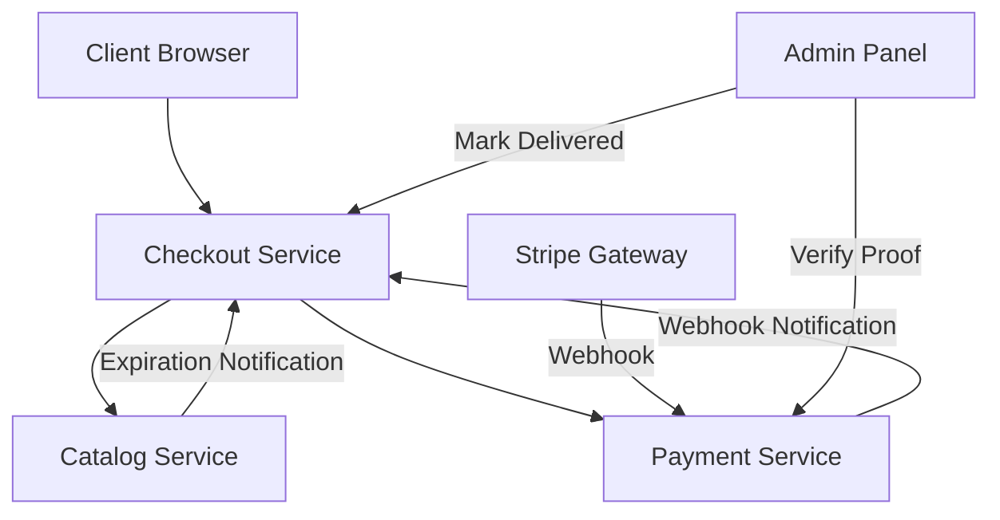

# Requirements

### Overview & Goals
Align the implementation of checkout, inventory reservation, and payment integration with the `checkout-flow.md` documentation to ensure consistency across microservices and handle all identified use cases.

### Scope
- **In Scope**:
    - Status Enum synchronization across all services.
    - Correction of the COD (Cash on Delivery) inventory commitment logic.
    - Implementation of the `MANUAL_TRANSFER` payment flow (proof submission & admin verification).
    - Inter-service notification for Stripe webhooks and inventory reservation expirations.
    - Implementation of payment timeouts (Stripe and Manual Transfer).
- **Out of Scope**:
    - Modifications to the frontend UI (Landing UI or Seller UI).
    - Changes to the actual Stripe payment processing logic (only status handling).

# Technical Design

### Current Implementation
- `checkout-service` calls `catalog-service` and `payment-service` during checkout.
- Communication is one-way via Spring `@HttpExchange` (REST).
- COD inventory is committed prematurely.
- `payment-service` webhooks update local transactions but don't notify `checkout-service`.
- `catalog-service` reservation cleanup doesn't notify `checkout-service`.

### Key Decisions
- **REST-based Inter-service Communication**: Continue using `@HttpExchange` for consistency with the existing architecture instead of introducing a messaging system (Kafka/RabbitMQ) at this stage.
- **Bi-directional Coordination**: Introduce `ExternalOrderService` to allow `payment-service` and `catalog-service` to notify `checkout-service` of asynchronous events (webhooks, expirations).

### Proposed Changes

#### 1. Data Model Alignment 
- Update `com.asrevo.cvhome.store.core.entity. order.orderstatus.OrderStatus`: Add `PENDING_PAYMENT`, `DELIVERING`.
- Update `com.asrevo.cvhome.store.core.entity.common.PaymentStatus`: Add `PROCESSING`, `EXPIRED`, `WAITING_VERIFICATION`, `REJECTED`.

#### 2. Inter-service Interfaces
- **New Interface**: `ExternalOrderService` in `store-pod/checkout/checkout-external-api`.
    - `updatePaymentStatus(StoreMerchantId store, String orderRef, PaymentStatus status)`
    - `handleReservationExpired(StoreMerchantId store, String orderRef)`
- **New API**: `ExternalOrderApi` in `checkout/checkout-service`.

#### 3. Flow Corrections
- **COD Flow**:
    - `OrderPlacementFacadeImpl`: Change `updateOrderStatusWithReservationCommit` to a simple status update to `CREATED`/`RESERVED` for `PAY_LATER`.
    - `OrderService`: When status changes to `DELIVERED` or `COMPLETED`, call `OrderInventoryOrchestrator.updateOrderStatusWithReservationCommit`.
- **Stripe Webhook**:
    - `PaymentGatewayService`: Add `ExternalOrderService` dependency and call it in `handleUseCase` to propagate `PAID` or `FAILED` status to `checkout-service`.
- **Reservation Expiration**:
    - `ProductReservationCleanupService`: Call `ExternalOrderService.handleReservationExpired` when a reservation is released due to timeout.

#### 4. Manual Transfer
- **Payment Service**:
    - Extend `Transaction` entity to store `proofImage` and `transactionNo`.
    - `PublicPaymentApi`: Add endpoint for proof submission.
    - `PrivatePaymentApi`: Add endpoints for admin approval/rejection.
- **Checkout Service**:
    - Add timeout logic (24-48h) to cancel orders if proof is not verified.

### Architecture Diagram

# Testing

### Validation Approach
- Verify COD flow: Inventory should be `RESERVED` after checkout and `COMMITTED` only after admin marks as `DELIVERED`.
- Verify Stripe flow: Webhook should trigger `COMMITTED` status in Catalog and `CONFIRMED` status in Checkout.
- Verify Manual Transfer: User submission should set payment to `WAITING_VERIFICATION`, and Admin approval should set it to `PAID` and `COMMITTED`.
- Verify Timeouts: Expired reservations in Catalog should result in `CANCELLED` orders in Checkout.

### Key Scenarios
- **COD Success**: Checkout -> Reserved -> Admin Delivered -> Committed + Paid.
- **Stripe Success**: Checkout -> Reserved -> Webhook Paid -> Committed + Confirmed.
- **Manual Success**: Checkout -> Reserved -> Proof Submitted -> Admin Approved -> Committed + Paid.
- **Stripe Timeout**: Checkout -> Reserved -> 30 min wait -> Inventory Released -> Order Cancelled.

# Delivery Steps

###   Step 1: Align enums and communication interfaces
Align enums and setup communication interfaces.
- Update `OrderStatus`, `PaymentStatus`, and `InventoryStatus` enums in `store-commons` to match `checkout-flow.md`.
- Create `ExternalOrderService` interface in `checkout-external-api` with methods for status updates (e.g., `updatePaymentStatus`, `notifyReservationExpired`).
- Implement `ExternalOrderApi` in `checkout-service` to handle these calls and update order/inventory states.

###   Step 2: Fix COD flow and inter-service coordination
Correct COD flow and implement inter-service notifications.
- Modify `OrderPlacementFacadeImpl` to maintain `RESERVED` inventory status for COD orders instead of committing immediately.
- Update `OrderService` to trigger inventory commit and set payment to `PAID` when an admin marks an order as `DELIVERED` or `COMPLETED`.
- Update `PaymentGatewayService` to call `ExternalOrderService` when receiving Stripe webhooks.
- Update `ProductReservationCleanupService` in `catalog-service` to notify `checkout-service` when a reservation expires.

###   Step 3: Implement Manual Transfer flow
Build Manual Transfer support.
- Implement `MANUAL_TRANSFER` handling in `PaymentGatewayService`.
- Create `Transaction` fields for proof (transaction number, image reference).
- Add public API in `payment-service` for customers to submit payment proof.
- Add private API in `payment-service` for admins to approve/reject payment proofs, triggering order status updates in `checkout-service`.

###   Step 4: Implement timeouts and robustness
Implement timeouts and error handling.
- Implement scheduled tasks in `checkout-service` to cancel orders if payment is not received within 30 minutes (Stripe) or 24-48 hours (Manual).
- Add logic to release inventory in `catalog-service` when an order is cancelled due to timeout.
- Implement idempotency checks for payment webhooks and status updates.