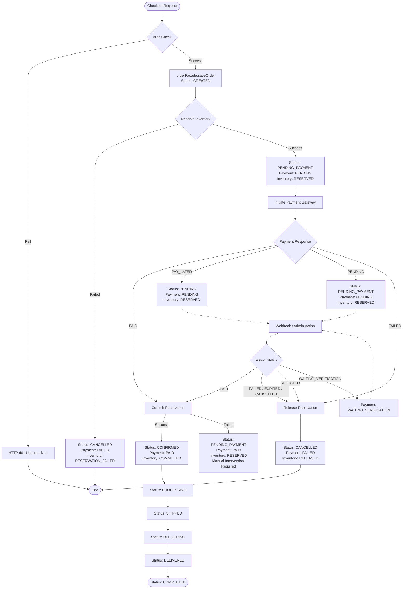

### Order Placement and Finalization Flow

The following diagram illustrates the current implementation of the order placement lifecycle, covering inventory reservation, payment initiation, and asynchronous status updates.

### Status Definitions and Mappings

#### Order Status (`OrderStatus`)
| Status | Description |
| :--- | :--- |
| `CREATED` | Initial state when the order record is first saved. |
| `PENDING_PAYMENT` | Inventory is reserved, awaiting successful payment confirmation. |
| `PENDING` | Used for Pay Later (COD) or Manual Transfer before confirmation. |
| `CONFIRMED` | Payment is successful and inventory reservation is committed. |
| `PROCESSING` | Order is being prepared for shipment. |
| `SHIPPED` / `DELIVERING` | Order is in transit. |
| `DELIVERED` / `COMPLETED` | Order has reached the customer. |
| `CANCELLED` | Terminal state for failed reservations, failed payments, or expired sessions. |

#### Payment Status (`PaymentStatus`)
- **Internal (Checkout):** `PENDING`, `PAID`, `FAILED`, `EXPIRED`, `CANCELLED`, `WAITING_VERIFICATION`, `REJECTED`.
- **Gateway (Payment):** Adds `PAY_LATER` (mapped to `PENDING` internally) and `PROCESSING`.

#### Inventory Status (`InventoryStatus`)
| Status | Description |
| :--- | :--- |
| `RESERVED` | Items are temporarily held in the catalog. |
| `COMMITTED` | Reservation finalized after successful payment. |
| `RELEASED` | Reservation cancelled and items returned to stock. |
| `RESERVATION_FAILED` | Initial attempt to hold items failed. |

### Key Logic Observations
1. **Atomic Reservation:** Order placement always attempts to reserve inventory before initiating payment.
2. **Orchestration:** `OrderPlacementFacade` coordinates between `OrderFacade` (local state), `OrderInventoryOrchestrator` (catalog interaction), and `IPaymentGatewayService` (payment).
3. **Propagation:** When an external payment gateway updates a transaction (via Webhook), the `PaymentGatewayService` propagates the status back to the Checkout service, which then triggers either a `commit` or `release` of the inventory reservation.
4. **Resiliency:** If a reservation commit fails after a successful payment, the system retains the order in `PENDING_PAYMENT` with `PAID` payment status to allow for manual reconciliation or retry, preventing data loss.
